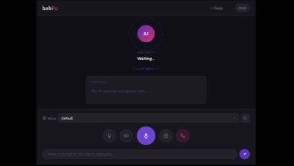

# BABILO: The High-Performance Local-First Language Tutor

**Babilo** is a low-latency, privacy-focused AI engine for language learning. Unlike cloud-based solutions, Babilo runs entirely on your hardware using a multimodal **End-to-End** approach. No subscriptions, no data tracking, just pure local inference.



> [!IMPORTANT]
> This repository contains the **Core Engine** only. Users are responsible for sourcing and placing their own models (Gemma 4 / Supertonic) from Hugging Face or similar repositories.


## 🛠️ Technical Stack (The Core)

| Component | Technology | Role / Notes |
| :--- | :--- | :--- |
| **Backend** | **Rust** | Audio buffer orchestration & memory safety. |
| **UI Framework** | **Tauri v2** | Lightweight native container (Rust-based). |
| **Frontend** | **Vite + Lit** | Native Web Components for maximum render speed. |
| **AI Engine** | **llamacpp + Vulkan** | Hardware-accelerated inference (AMD/NVIDIA/Intel). |
| **Multimodal LLM** | **Gemma 4 9B** | Native Voice/Text processing (Direct STT). |
| **TTS Engine** | **Supertonic** | Natural polyglot voice synthesis. |

---

## 🚀 Architecture & Data Flow

Babilo eliminates friction by removing intermediate models (like Whisper) and going straight from **Voice Input -> Multimodal LLM -> Voice Output**.
1. **Audio Capture:** Handled via Rust streams.
2. **Processing:** Vulkan-accelerated inference via Gemma 4.
3. **Privacy:** Zero data leaves your machine. 100% Offline.


## 💼 Supporting the Project

Babilo will **always remain fully open source** under the GPLv3 license. Our core belief is that privacy and local-first software should be accessible to everyone.

However, maintaining and improving a high-quality application takes significant time and resources. To make the project sustainable, we are developing a **commercial version** distributed through Steam.

### What to expect from the Steam version:
- **Plug & Play experience** — One-click installer
- Automatic model downloading and management
- Pre-optimized builds for different GPUs
- Seamless updates
- Additional voice packs and quality-of-life features
- Direct support from the developer

This paid version is aimed at users who want convenience and prefer not to compile the project themselves. 

**The source code will always stay free.** You can build Babilo from source at any time if you prefer the fully DIY approach.

---

**Early Access planned for September 2026.**

We appreciate every form of support — whether by starring the repo, contributing code, or purchasing the Steam version to help sustain development.

## ⚖️ License

Distributed under the **GPLv3 License**. See `LICENSE` for more information. Built with ❤️ for the privacy-first community.

## 🗺️ Roadmap

### v0.1 - Core Engine (Current)
- [x] Rust + Tauri backend
- [x] llama.cpp + Vulkan integration
- [x] Multimodal support with Gemma 4
- [x] Real-time audio capture and playback
- [x] Supertonic TTS integration

### v0.2 - Early Access (September 2026)
- [ ] Polished and user-friendly interface
- [ ] Smooth conversational mode
- [ ] Initial language support: **Spanish ↔ English**
- [ ] Stable fully offline experience
- [ ] Plug & Play Steam version 

### v0.3 - Q4 2026
- [ ] Additional languages (French, German, Portuguese, Japanese, etc.)
- [ ] Advanced pronunciation feedback and correction
- [ ] Immersion mode (voice-only)

### v1.0 - Stable Release (2027)
- [ ] Progress export and statistics
- [ ] Support for multiple local models
- [ ] Community voice pack sharing
- [ ] Improved Linux & macOS support

### Future (Beyond v1.0)
- Larger local model support
- Integration with Anki and other tools
- Multiplayer guided conversations
- Tools for teachers and self-learners
- Structured lessons and progress system

---

**Note:** This roadmap is public and subject to change based on community feedback and priorities. We value **quality and low latency** over rapid feature addition.

## 🤝 Contributing & Feedback

We welcome genuine contributions and feedback! Babilo is still in early development, but if you're passionate about the project, feel free to get involved.

### How to contribute:
- **News & Updates**: Stay tuned for the latest announcements and project news in our [Telegram channel](https://t.me/babilo_official). 
- **Issues**: This is the place for **feedback, ideas, and bug reports**. Please open an issue first to discuss any change or feature you want to work on.
- **Pull Requests**: We maintain **high standards** for code quality.

### What we expect from PRs:
- **Full Understanding**: You must fully understand the code you submit.
- **Atomic Changes**: Small, focused improvements (quality over quantity).
- **Clear Context**: A clear explanation of *why* the change is needed.
- **Human Oversight**: No un-reviewed AI-generated code.

All serious contributors will be properly credited in the future.

Thank you in advance to everyone who helps make Babilo better ❤️


## 🏗️ Getting Started (For Devs)

**Note**: Babilo is currently in **early core stage**. The setup is technical and requires manual steps.

### 💻 Hardware & System Requirements

To ensure low-latency inference and real-time voice processing, your system must meet the following:

*   **GPU:** Dedicated GPU with at least **8GB VRAM**.
*   **Driver:** Latest drivers with **Vulkan** support.
*   **Compiler:** **Vulkan SDK** installed (required for `llamacpp` hardware acceleration during build).
*   **Memory:** 16GB System RAM recommended.
*   **OS:** Windows 10/11, Linux (Ubuntu 22.04+ recommended), or macOS (Metal).

---

### ⚙️ Full Installation & Setup

Follow these steps precisely to get the engine running with local weights.

### 1. Clone the Repository
```bash
git clone https://github.com/your-user/babilo-core.git
cd babilo-core
```

### 2. Dependency Setup
Ensure you have the **Rust toolchain** and **Node.js** installed, then:
```bash
npm install
```

### 3. Sourcing the Models (Manual Step)
Babilo requires specific weights to be placed in the `/models` and `/assets` directories.

*   **LLM & Multimodal:** Download the following from Hugging Face and place them in `/models/`:
    *   `gemma-4-E4B-it-Q4_0.gguf` (The core language model)
    *   `mmproj-BF16.gguf` (The multimodal projection for audio/vision)
*   **TTS Assets:** Clone the Supertonic weights into the `/assets` folder:
    ```bash
    git clone https://huggingface.co/Supertone/supertonic-2 assets
    ```

### 4. Compiling with Vulkan Acceleration
To build the engine with GPU support, use the following command:
```bash
# This will trigger the Rust build with llamacpp-vulkan features
npm run tauri dev
```

---

## 📂 Expected Directory Structure
Your project tree should look like this before running:
```text
babilo-core/
├── assets/              <-- Supertonic weights (git cloned)
├── models/
│   ├── gemma-4-E4B-it-Q4_0.gguf
│   └── mmproj-BF16.gguf
├── src/                 <-- Frontend (Lit)
├── src-tauri/           <-- Backend (Rust)
└── ...
```

---

## ✨ Contributors

We use the [All Contributors](https://github.com/all-contributors/all-contributors) specification. Contributors will be featured here and on our official landing page hall of fame.

<!-- ALL-CONTRIBUTORS-LIST:START - Do not remove or modify this section -->
<a href="https://github.com/lutgaru/babilo/graphs/contributors">
  
</a>
<!-- ALL-CONTRIBUTORS-LIST:END -->

